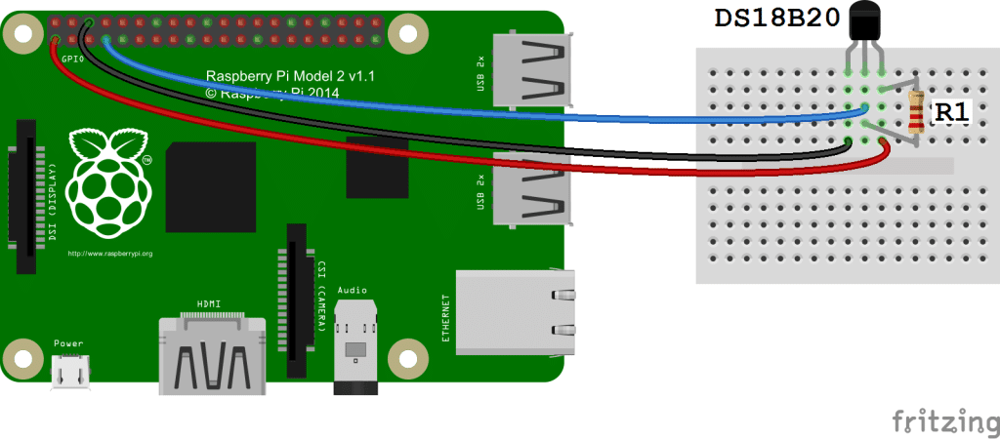

# DEPRECATED - This project is deprecated and will no longer be maintained 

The project Prometheus Temperature exporter for raspberry pi is no longer be maintained and will be superseded by https://github.com/lukibahr/raspbi-ds18b20-exporter. 

[](https://ci.devopoly.de/lukibahr/raspbi-temperature-exporter) [](https://lbesson.mit-license.org/) [](https://github.com/ellerbrock/open-source-badges/)

Prometheus Endpoint, written in Python to read 1wire sensor and exposes temperature values as a prometheus metric.


## Wiring

Depending on the type of the sensor, you'll have to wire the sensor with a 4.7K Ohm resistor. The following sample wiring might help: 



## Prerequisites

Make sure, you have the required kernel modules loaded. To do so, follow these steps:

```bash
$ sudo modprobe w1-gpio
$ sudo modprobe w1-therm 
$ sudo echo "dtoverlay=w1-gpio" >> /boot/config.txt #to enable 1-wire config and persist after reboot
$ lsmod #check if modules are loaded correctly
$ sudo reboot
```

After your pi has been rebooted, check if you can list the attached 1-wire devices

```bash
$ ls /sys/bus/w1/devices/
```

## Implementation

Have a look at the sourcecode for details. Generally, you'll have to download and import the required python libraries.
Refer to the official documentation on how to implement a prometheus exporter: https://github.com/prometheus/client_python.

## Dockerrization

I've used hypriot os with a RaspberryPi 3B+. It works on a Raspberry Pi 2 too, although docker builds might take some time, so be calm to your Pi.

## Building and running

You can run the exporter either via python itself or in a docker container. The required commands for running it via python are 
also in the supplied Makefile. For docker use:

```bash
$ docker build -t raspbi-temperature-exporter:arm32v6 -f Dockerfile .
$ docker run -it -e EXPORTER_PORT=9103 -p 9103:9103 raspbi-temperature-exporter:arm32v6
```

You can also download it from docker hub via `docker pull lukasbahr/raspbi-temperature-exporter:arm32v6`

## Open ToDo's

- [DONE] Add CI/CD Support
- [OPEN] Add unit tests
- [OPEN] use buildx to create the proper image
- [OPEN] Add health metric, error metric, scrape interval, general information about exporter etc.

## Further reading / links

- The wiring image originates from: http://www.circuitbasics.com/raspberry-pi-ds18b20-temperature-sensor-tutorial/
